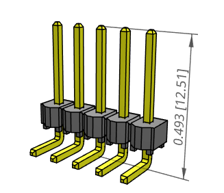

[link up a level../](../)

# Samtec

## terminal cart:

[https://www.digikey.com/short/pd8h0n](https://www.digikey.com/short/pd8h0n)

## straight terminal strips

TSW-105-07-G-S	[5 pin]

TSW-103-07-G-S	[3 pin, used for neopixel]

TSW-104-07-G-S	[4 pin, used for I2C sensor]

TSW-105-07-G-S	[5 pin used for output to dual h bridge from UNO shield]

# 90 degree terminal strips for dual h bridge:

5 pin:
TSW-105-25-G-S-RA	

4 pin:

TSW-104-25-G-S-RA

## 5 wire cable from shield to dual h bridge:

idss-05-d-06.00

## 4 wire cable to solder stripped ends for stepper motor and also I2C sensors(need as many of these as stepper motors plus I2 C sensors.):

not this:

IDSS-04-S-08.00-T	(8 inches)  these are not stripped!

this, with "ST"

IDSS-04-S-08.00-ST8	(8 inches)

## 3 wire cable with solder tinned ends for neopixels, 8 inch:

not this:

IDSS-03-S-08.00-T

but this:

IDSS-03-S-08.00-ST8

[link up a level../](../)

